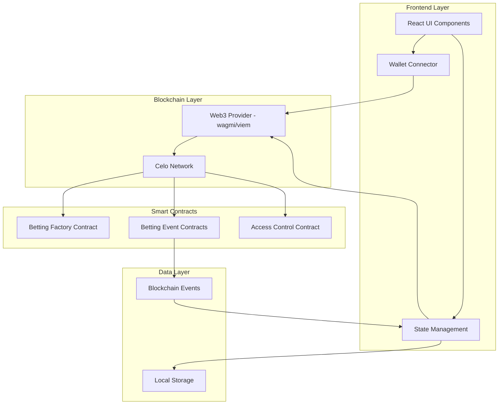

# Design Document: Celo Betting Platform

## Overview

The Celo Betting Platform is a decentralized betting application built on the Celo blockchain. It combines smart contract functionality with a gamified, Kahoot-inspired user interface to create an engaging betting experience. The platform supports both binary and multiple outcome betting events across various categories, with automatic payout distribution and real-time odds calculation.

### Key Design Principles

1. **Blockchain-First Architecture**: All betting logic, fund management, and payout distribution handled by smart contracts
2. **User-Created Content**: Any user can create betting events, similar to creating Kahoots
3. **Social Sharing**: Easy sharing of events via links to invite others to participate
4. **Gamification**: Vibrant, animated UI with celebratory feedback and progress tracking
5. **Real-Time Updates**: Live odds calculation and event status updates
6. **Security & Transparency**: Immutable contracts, on-chain verification, and transparent transaction history
7. **User Experience**: Seamless wallet integration with minimal friction

## Architecture

### High-Level Architecture



### Technology Stack

**Frontend:**
- React 18 with TypeScript
- Vite for build tooling
- TailwindCSS for styling
- shadcn/ui for base components
- Framer Motion for animations
- React Router for navigation
- TanStack Query for data fetching and caching

**Blockchain Integration:**
- wagmi v2 for React hooks
- viem for Ethereum interactions
- RainbowKit or ConnectKit for wallet connection UI
- Celo-specific configurations

**Smart Contracts:**
- Solidity 0.8.x
- Hardhat for development and testing
- OpenZeppelin contracts for security patterns
- Celo ContractKit for Celo-specific features

**State Management:**
- Zustand for global state
- TanStack Query for server state
- React Context for wallet state

## Components and Interfaces

### Frontend Components

#### 1. Wallet Connection Components

**WalletConnectButton**
- Displays "Connect Wallet" when disconnected
- Shows wallet address (truncated) and balance when connected
- Handles wallet provider selection (MetaMask, Valora, WalletConnect)
- Manages connection state and errors

**WalletProvider**
- Context provider wrapping the application
- Manages wallet connection lifecycle
- Provides wallet state to all child components
- Handles network switching to Celo

#### 2. Event Display Components

**EventGrid**
- Displays all active betting events in a grid layout
- Supports category filtering
- Shows event cards with key information
- Implements infinite scroll or pagination
- Real-time updates via blockchain event listeners

**EventCard**
- Displays single event summary
- Shows: title, category, time remaining, total pool, participant count
- Animated hover effects
- Click to navigate to event details
- Visual indicators for event status (active, closing soon, ended)

**EventDetails**
- Full event information display
- Outcome options with current odds
- Pool distribution visualization (pie chart or bar chart)
- Participant count per outcome
- Countdown timer
- Bet placement interface

#### 3. Betting Interface Components

**BetPlacementModal**
- Outcome selection (binary or multiple)
- Bet amount input with validation
- Potential payout calculation display
- Wallet balance check
- Transaction confirmation flow
- Loading states during blockchain transaction
- Success/error feedback with animations

**OutcomeSelector**
- For binary bets: Two large, colorful buttons (Kahoot-style)
- For multiple outcomes: Grid of outcome cards
- Visual feedback on selection
- Displays current odds for each outcome
- Shows percentage of pool on each outcome

**BetAmountInput**
- Numeric input with increment/decrement buttons
- Quick amount buttons (e.g., 1, 5, 10, 25 CELO)
- Max button to bet entire balance
- Real-time payout calculation
- Balance validation

#### 4. User Dashboard Components

**MyBetsPanel**
- Tabs for "Active Bets" and "Bet History"
- List of user's bets with key details
- Status indicators (pending, won, lost)
- Payout information
- Links to blockchain explorer

**BetCard**
- Individual bet display
- Event name and outcome chosen
- Bet amount and potential/actual payout
- Status badge
- Time placed and time remaining/concluded
- Transaction hash link

**UserStatsWidget**
- Total bets placed
- Win rate percentage
- Total winnings
- Current ranking (if leaderboard exists)
- Visual progress indicators and badges
- Animated counters

#### 5. Event Creation and Sharing Components

**EventCreationForm**
- Event type selector (binary/multiple)
- Event title and description inputs
- Category selector
- Duration picker
- Outcome configuration:
  - Binary: Two outcome labels
  - Multiple: Dynamic outcome list (3-10 outcomes)
- Smart contract deployment trigger
- Transaction status feedback
- Automatic share link generation on success

**ShareEventButton**
- Copy link to clipboard functionality
- Social media share options (Twitter, WhatsApp, Telegram)
- QR code generation for mobile sharing
- Share preview with event title and description
- Share count tracking

**MyEventsPanel**
- List of events created by the connected user
- Event status (active, ended, concluded)
- Participant count and total pool for each event
- Quick access to conclude event (for creator only)
- Share button for each event
- Event statistics and performance metrics

#### 6. Gamification Components

**AnimatedTransitions**
- Page transition animations
- Slide, fade, and scale effects
- Smooth navigation experience

**CelebrationOverlay**
- Triggered on successful bet placement
- Confetti animation
- Success message with bet details
- Sound effects (optional, with mute toggle)

**LeaderboardDisplay**
- Animated list of top winners
- User rankings with avatars/addresses
- Total winnings display
- Highlight current user's position
- Periodic updates

**ProgressIndicators**
- Circular progress for time remaining
- Linear progress for pool filling
- Animated stat counters
- Achievement badges

### Smart Contract Architecture

#### 1. BettingFactory Contract

**Purpose:** Deploys and manages individual betting event contracts

**Key Functions:**
```solidity
function createBinaryEvent(
    string memory title,
    string memory description,
    string memory category,
    uint256 duration,
    string[2] memory outcomes
) external returns (address)

function createMultipleOutcomeEvent(
    string memory title,
    string memory description,
    string memory category,
    uint256 duration,
    string[] memory outcomes
) external returns (address)

function getAllActiveEvents() external view returns (address[] memory)

function getEventsByCategory(string memory category) external view returns (address[] memory)

function getEventCreator(address eventAddress) external view returns (address)
```

**State Variables:**
- `address[] public allEvents` - Array of all deployed event contracts
- `mapping(address => bool) public isValidEvent` - Validation mapping
- `mapping(string => address[]) public eventsByCategory` - Category index
- `mapping(address => address) public eventCreators` - Maps event address to creator address

**Events:**
```solidity
event EventCreated(address indexed eventAddress, address indexed creator, string eventType, string category, uint256 endTime)
```

#### 2. BettingEvent Contract (Base)

**Purpose:** Manages individual betting events, handles bets and payouts

**Key Functions:**
```solidity
function placeBet(uint8 outcomeIndex) external payable

function concludeEvent(uint8 winningOutcome) external onlyCreator

function calculatePayout(address bettor) public view returns (uint256)

function getCreator() external view returns (address)

function getEventDetails() external view returns (
    string memory title,
    string memory description,
    uint256 endTime,
    uint256 totalPool,
    bool concluded,
    uint8 winningOutcome
)

function getOutcomeDetails(uint8 outcomeIndex) external view returns (
    string memory label,
    uint256 totalBets,
    uint256 bettorCount
)

function getUserBets(address user) external view returns (
    uint8[] memory outcomes,
    uint256[] memory amounts
)
```

**State Variables:**
```solidity
struct Bet {
    address bettor;
    uint8 outcome;
    uint256 amount;
    uint256 timestamp;
    bool paid;
}

struct Outcome {
    string label;
    uint256 totalBets;
    uint256 bettorCount;
}

string public title;
string public description;
string public category;
uint256 public endTime;
uint256 public totalPool;
bool public concluded;
uint8 public winningOutcome;
address public creator;
Outcome[] public outcomes;
Bet[] public bets;
mapping(address => uint256[]) public userBetIndices;
```

**Events:**
```solidity
event BetPlaced(address indexed bettor, uint8 outcome, uint256 amount, uint256 timestamp)
event EventConcluded(uint8 winningOutcome, uint256 totalPool, uint256 timestamp)
event PayoutDistributed(address indexed winner, uint256 amount)
```

**Modifiers:**
```solidity
modifier onlyBeforeEnd() {
    require(block.timestamp < endTime, "Event has ended");
    _;
}

modifier onlyAfterEnd() {
    require(block.timestamp >= endTime, "Event not ended yet");
    _;
}

modifier onlyCreator() {
    require(msg.sender == creator, "Only creator can call");
    _;
}
```

#### 3. BinaryBettingEvent Contract

**Purpose:** Specialized contract for binary (yes/no) betting events

**Inherits:** BettingEvent

**Constructor:**
```solidity
constructor(
    string memory _title,
    string memory _description,
    string memory _category,
    uint256 _duration,
    string[2] memory _outcomes,
    address _creator
)
```

**Additional Validation:**
- Ensures exactly 2 outcomes
- Validates outcome index is 0 or 1

#### 4. MultipleOutcomeBettingEvent Contract

**Purpose:** Specialized contract for events with 3-10 possible outcomes

**Inherits:** BettingEvent

**Constructor:**
```solidity
constructor(
    string memory _title,
    string memory _description,
    string memory _category,
    uint256 _duration,
    string[] memory _outcomes,
    address _creator
)
```

**Additional Validation:**
- Ensures 3-10 outcomes
- Validates outcome index is within range

### Payout Calculation Logic

**Proportional Payout System:**

For each winning bet:
```
Payout = (BetAmount / TotalWinningBets) * TotalPool
```

Where:
- `BetAmount` = Amount wagered by the bettor on winning outcome
- `TotalWinningBets` = Sum of all bets on the winning outcome
- `TotalPool` = Sum of all bets on all outcomes

**Example:**
- Event: "Will it rain tomorrow?" (Binary)
- Outcome A (Yes): 100 CELO from 10 bettors
- Outcome B (No): 200 CELO from 15 bettors
- Total Pool: 300 CELO
- Winning Outcome: A (Yes)

Bettor who placed 10 CELO on A:
```
Payout = (10 / 100) * 300 = 30 CELO
Profit = 30 - 10 = 20 CELO (200% return)
```

**Gas Optimization:**
- Batch payout processing
- Pull payment pattern for large events
- Automatic distribution for events with < 50 winners
- Manual claim function for larger events

## Data Models

### Frontend TypeScript Interfaces

```typescript
// Wallet Types
interface WalletState {
  address: string | null;
  balance: bigint;
  chainId: number;
  isConnected: boolean;
  isConnecting: boolean;
  error: Error | null;
}

// Event Types
enum EventType {
  BINARY = 'binary',
  MULTIPLE = 'multiple'
}

enum EventStatus {
  ACTIVE = 'active',
  CLOSING_SOON = 'closing_soon',
  ENDED = 'ended',
  CONCLUDED = 'concluded'
}

interface Outcome {
  index: number;
  label: string;
  totalBets: bigint;
  bettorCount: number;
  odds: number; // Calculated on frontend
  poolPercentage: number; // Calculated on frontend
}

interface BettingEvent {
  address: string;
  title: string;
  description: string;
  category: string;
  eventType: EventType;
  endTime: number; // Unix timestamp
  totalPool: bigint;
  outcomes: Outcome[];
  status: EventStatus;
  concluded: boolean;
  winningOutcome?: number;
  participantCount: number;
}

// Bet Types
enum BetStatus {
  PENDING = 'pending',
  ACTIVE = 'active',
  WON = 'won',
  LOST = 'lost'
}

interface UserBet {
  id: string; // Transaction hash
  eventAddress: string;
  eventTitle: string;
  outcomeIndex: number;
  outcomeLabel: string;
  amount: bigint;
  potentialPayout: bigint;
  actualPayout?: bigint;
  timestamp: number;
  status: BetStatus;
  transactionHash: string;
}

// User Stats Types
interface UserStats {
  totalBets: number;
  activeBets: number;
  wonBets: number;
  lostBets: number;
  totalWagered: bigint;
  totalWinnings: bigint;
  winRate: number; // Percentage
  rank?: number;
}

// Transaction Types
interface Transaction {
  hash: string;
  type: 'bet' | 'payout' | 'create_event';
  status: 'pending' | 'confirmed' | 'failed';
  timestamp: number;
  amount?: bigint;
  eventAddress?: string;
}
```

### Smart Contract Data Structures

```solidity
// In BettingEvent.sol
struct Bet {
    address bettor;
    uint8 outcome;
    uint256 amount;
    uint256 timestamp;
    bool paid;
}

struct Outcome {
    string label;
    uint256 totalBets;
    uint256 bettorCount;
}

struct EventInfo {
    string title;
    string description;
    string category;
    uint256 endTime;
    uint256 totalPool;
    bool concluded;
    uint8 winningOutcome;
}
```

## Error Handling

### Frontend Error Handling

**Wallet Connection Errors:**
- User rejected connection: Display friendly message with retry option
- Wrong network: Prompt to switch to Celo network
- Wallet not installed: Show installation instructions
- Connection timeout: Retry with exponential backoff

**Transaction Errors:**
- Insufficient balance: Display clear message with current balance
- Gas estimation failed: Show estimated gas and suggest increasing
- Transaction rejected: Allow retry or cancel
- Transaction failed: Display error reason from blockchain
- Network congestion: Show estimated wait time

**Contract Interaction Errors:**
- Event ended: Prevent bet placement, show event status
- Invalid outcome: Validate before submission
- Minimum bet not met: Display minimum requirement
- Contract not found: Handle gracefully, suggest refresh

**Error Display Strategy:**
- Toast notifications for non-critical errors
- Modal dialogs for critical errors requiring action
- Inline validation messages for form errors
- Error boundaries for component crashes
- Retry mechanisms with exponential backoff

### Smart Contract Error Handling

**Custom Errors (Gas Efficient):**
```solidity
error EventEnded();
error EventNotEnded();
error InvalidOutcome();
error InsufficientBetAmount();
error EventAlreadyConcluded();
error Unauthorized();
error PayoutFailed();
error InvalidEventDuration();
error InvalidOutcomeCount();
```

**Require Statements with Clear Messages:**
```solidity
require(block.timestamp < endTime, "Event has ended");
require(msg.value >= minimumBet, "Bet amount too low");
require(outcomeIndex < outcomes.length, "Invalid outcome");
require(!concluded, "Event already concluded");
require(msg.sender == admin, "Only admin");
```

**Safe Transfer Pattern:**
```solidity
function distributePayout(address winner, uint256 amount) internal {
    (bool success, ) = winner.call{value: amount}("");
    if (!success) {
        // Store failed payout for manual claim
        failedPayouts[winner] += amount;
        emit PayoutFailed(winner, amount);
    } else {
        emit PayoutDistributed(winner, amount);
    }
}

function claimFailedPayout() external {
    uint256 amount = failedPayouts[msg.sender];
    require(amount > 0, "No failed payout");
    failedPayouts[msg.sender] = 0;
    (bool success, ) = msg.sender.call{value: amount}("");
    require(success, "Claim failed");
}
```

## Testing Strategy

### Smart Contract Testing

**Unit Tests (Hardhat + Chai):**
- Test each contract function in isolation
- Test access control and modifiers
- Test edge cases and boundary conditions
- Test event emissions
- Test revert conditions

**Integration Tests:**
- Test factory contract creating event contracts
- Test full betting lifecycle (create → bet → conclude → payout)
- Test multiple users interacting with same event
- Test admin functions

**Security Tests:**
- Reentrancy attack prevention
- Integer overflow/underflow (Solidity 0.8.x)
- Access control bypass attempts
- Front-running scenarios
- Gas limit attacks

**Test Coverage Goals:**
- Minimum 90% code coverage
- 100% coverage for critical functions (payout, bet placement)

### Frontend Testing

**Component Tests (React Testing Library):**
- Test wallet connection flow
- Test bet placement UI
- Test event display and filtering
- Test form validation
- Test error states

**Integration Tests:**
- Test wallet connection → event selection → bet placement flow
- Test real-time updates when events change
- Test navigation between pages
- Test admin event creation flow

**E2E Tests (Playwright or Cypress):**
- Full user journey: connect wallet → browse events → place bet → view history
- Admin journey: create event → monitor → conclude event
- Test on local blockchain (Hardhat network)

**Mock Strategy:**
- Mock wallet connections for unit tests
- Mock blockchain interactions for component tests
- Use local Hardhat network for integration tests
- Test against Celo Alfajores testnet for final validation

### Performance Testing

**Frontend Performance:**
- Lighthouse scores (target: 90+ for performance)
- Bundle size optimization
- Lazy loading for routes and heavy components
- Image optimization

**Smart Contract Gas Optimization:**
- Gas profiling for all functions
- Optimize storage patterns
- Batch operations where possible
- Compare gas costs across different implementations

## Gamification Design Details

### Visual Design (Kahoot-Inspired)

**Color Palette:**
- Primary: Vibrant purple (#7C3AED)
- Secondary: Electric blue (#3B82F6)
- Success: Bright green (#10B981)
- Warning: Sunny yellow (#F59E0B)
- Error: Bold red (#EF4444)
- Background: Deep dark (#0F172A) with gradient overlays

**Typography:**
- Headings: Bold, large, high contrast
- Body: Clear, readable, 16px minimum
- Numbers: Monospace for amounts and odds

**Button Styles:**
- Large, rounded buttons with shadows
- Hover effects: scale up, glow
- Active state: press down animation
- Disabled state: grayscale with reduced opacity

### Animation Specifications

**Page Transitions:**
- Duration: 300ms
- Easing: ease-in-out
- Type: Fade + slide (20px)

**Bet Placement Success:**
- Confetti burst from center
- Success message fade in with scale
- Checkmark animation
- Sound effect (optional)
- Duration: 2 seconds

**Odds Update:**
- Number counter animation
- Color flash on significant change (>10%)
- Duration: 500ms

**Countdown Timer:**
- Pulse animation when < 1 hour remaining
- Color change: green → yellow → red
- Urgent state: faster pulse + glow

**Leaderboard:**
- Staggered entry animation (100ms delay per item)
- Highlight user's position with glow
- Trophy icons for top 3
- Smooth position changes

### Sound Effects (Optional)

**Events:**
- Bet placed: Success chime
- Bet won: Celebration fanfare
- Bet lost: Gentle disappointment tone
- Event ending soon: Alert beep
- Navigation: Subtle click

**Implementation:**
- Use Web Audio API
- Mute toggle in settings
- Respect user's system sound preferences
- Preload sounds for instant playback

### Progress & Achievement System

**User Levels:**
- Beginner: 0-10 bets
- Intermediate: 11-50 bets
- Advanced: 51-200 bets
- Expert: 201+ bets

**Badges:**
- First Bet: Place your first bet
- Lucky Streak: Win 3 bets in a row
- High Roller: Place a bet > 100 CELO
- Diversified: Bet on 5 different categories
- Early Bird: Bet within first hour of event creation
- Underdog: Win a bet with < 20% pool share

**Visual Indicators:**
- Progress bars for level advancement
- Badge showcase on profile
- Animated badge unlock notifications

## Security Considerations

### Smart Contract Security

**Best Practices:**
- Use OpenZeppelin audited contracts
- Implement ReentrancyGuard for all payable functions
- Use pull payment pattern for payouts
- Implement circuit breaker (pause functionality)
- Time-lock for admin functions
- Multi-sig wallet for admin operations (production)

**Access Control:**
- Role-based permissions (admin, user)
- Event-specific admin (creator can conclude their events)
- Factory owner can upgrade factory logic (if upgradeable)

**Fund Security:**
- All funds held in escrow until event conclusion
- No admin withdrawal of user funds
- Automatic payout distribution
- Failed payout recovery mechanism

**Audit Requirements:**
- Professional audit before mainnet deployment
- Bug bounty program
- Continuous monitoring for suspicious activity

### Frontend Security

**Wallet Security:**
- Never request private keys
- Use established wallet connection libraries
- Validate all user inputs
- Sanitize displayed data
- Implement rate limiting for API calls

**Data Validation:**
- Validate all form inputs
- Check bet amounts against balance
- Verify contract addresses
- Validate outcome indices
- Check event status before allowing bets

**XSS Prevention:**
- Sanitize all user-generated content
- Use React's built-in XSS protection
- Validate and escape event titles/descriptions
- Content Security Policy headers

## Deployment Strategy

### Smart Contract Deployment

**Development:**
1. Deploy to local Hardhat network
2. Run full test suite
3. Deploy to Celo Alfajores testnet
4. Conduct integration testing

**Staging:**
1. Deploy to Celo Alfajores with production-like data
2. Conduct user acceptance testing
3. Performance and security testing
4. Bug fixes and optimizations

**Production:**
1. Final audit review
2. Deploy to Celo Mainnet
3. Verify contracts on Celoscan
4. Monitor for 24 hours with limited access
5. Gradual rollout to users

### Frontend Deployment

**Build Process:**
1. Run linting and type checking
2. Run test suite
3. Build production bundle
4. Optimize assets
5. Generate source maps

**Hosting:**
- Static hosting (Vercel, Netlify, or Cloudflare Pages)
- CDN for global distribution
- HTTPS enforced
- Environment-specific builds (dev, staging, prod)

**Environment Variables:**
```
VITE_CELO_NETWORK=mainnet|alfajores|local
VITE_FACTORY_CONTRACT_ADDRESS=0x...
VITE_WALLETCONNECT_PROJECT_ID=...
VITE_ENABLE_SOUNDS=true|false
```

### Monitoring & Maintenance

**Smart Contract Monitoring:**
- Event listener for all contract events
- Alert on unusual activity (large bets, rapid betting)
- Gas price monitoring
- Failed transaction tracking

**Frontend Monitoring:**
- Error tracking (Sentry)
- Analytics (privacy-focused)
- Performance monitoring (Web Vitals)
- User feedback collection

**Maintenance Plan:**
- Regular dependency updates
- Security patch deployment
- Feature releases (bi-weekly)
- Bug fix releases (as needed)

## Future Enhancements

**Phase 2 Features:**
- Social features (follow bettors, share bets)
- Live chat during events
- Mobile app (React Native)
- Push notifications for event endings and wins
- Betting pools (group betting)

**Phase 3 Features:**
- AI-powered odds prediction
- Historical data analytics
- Custom event creation by users (with moderation)
- NFT rewards for achievements
- Cross-chain support (other EVM chains)

**Scalability Considerations:**
- Layer 2 solutions for lower gas fees
- Event archival strategy
- Database for historical data (The Graph)
- Caching strategies for frequently accessed data
